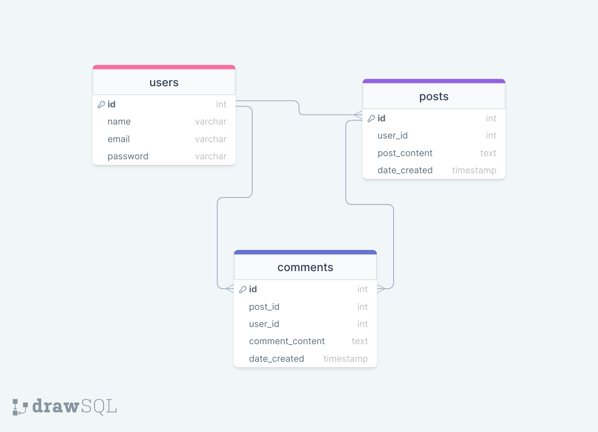

## SIMPLE BLOGPOST LARAVEL API
A fully functional RESTful API for blog system built with laravel. It includes the following concepts:
- CRUD system
- Provide the Entity Relationship Diagram of the system.
- Possible entities: ['Users','Posts','Comments'] <br>

Tools: Laravel, Postman API, etc

## Database Model
The Entity Relationship (ER) Diagram Model of the blog system             |
:-------------------------:
  

## Quick Installation ⚙️
First, clone repo and install all dependencies.
```sh
$ git clone https://github.com/Godstyme/simple_blogpost_laravel_api.git
$ cd simple_blogpost_laravel_api
$ composer install
```
Setup database by creating a database called `blog_post` in your `phpMyAdmin`. This example uses the `blog_post` database as configured in the app `.env` file.
We have to use a migration command to prepare the database migration classes for the target tables.

```sh
$ php artisan migrate
$ php artisan serve
``` 

Don't forget to star the project :)


## Getting Started with Laravel

For help getting started with Laravel, check out [documentation](https://laravel.com/docs)
<br>
If you don't feel like reading, [Laracasts](https://laracasts.com) can help. 

